<body style="background: #ffffff;">
# 🏗️ Medyo — Complete Architecture & Module Flow Graphs

> **Medyo** is a modular Android medicine-scanning app powered by **Gemini AI** (Firebase AI Logic). Users scan medicine images via CameraX, the AI analyzes them, and results are persisted locally via Room.

---

## 📋 Table of Contents

1. [High-Level Module Dependency Graph](#1-high-level-module-dependency-graph)
2. [Feature Module API/Impl Pattern](#2-feature-module-apiimpl-separation)
3. [Core Module Internal Dependencies](#3-core-module-internal-dependencies)
4. [Medicine Scan — End-to-End Data Flow](#4-medicine-scan--end-to-end-data-flow)
5. [Navigation System Architecture](#5-navigation-system--multi-stack-tab-architecture)
6. [UI Layer — Unidirectional Data Flow](#6-ui-layer--unidirectional-data-flow-udf)
7. [Data Layer — Repository Pattern](#7-data-layer--repository-pattern)
8. [AI Logic Pipeline — Gemini Integration](#8-ai-logic-pipeline--gemini-integration)
9. [Logger Module — API/Impl Pattern](#9-logger-module--apiimpl-pattern)
10. [User Journey Flowchart](#10-user-journey-flowchart)

---

## 1. High-Level Module Dependency Graph

This is the **master graph** showing every module in the project and how they connect. Derived from all `build.gradle.kts` files.

```mermaid
%%{init: {'theme': 'neutral', 'themeVariables': { 'darkMode': false }}}%%

graph TD
    classDef app fill:#ff6b6b,stroke:#c92a2a,stroke-width:3px,color:#fff;
    classDef featureApi fill:#e8d5f5,stroke:#7c3aed,stroke-width:2px;
    classDef featureImpl fill:#c4b5fd,stroke:#7c3aed,stroke-width:2px;
    classDef core fill:#bbf7d0,stroke:#16a34a,stroke-width:2px;
    classDef coreAI fill:#fef08a,stroke:#ca8a04,stroke-width:2px;
    classDef logger fill:#fecaca,stroke:#dc2626,stroke-width:2px;

    App[":app"]:::app

    %% Feature API Modules
    HomeAPI[":feature:home:api"]:::featureApi
    HomeImpl[":feature:home:impl"]:::featureImpl
    BioScanAPI[":feature:bio-scan:api"]:::featureApi
    BioScanImpl[":feature:bio-scan:impl"]:::featureImpl
    ScannerAPI[":feature:scanner:api"]:::featureApi
    ScannerImpl[":feature:scanner:impl"]:::featureImpl
    SettingsAPI[":feature:settings:api"]:::featureApi
    SettingsImpl[":feature:settings:impl"]:::featureImpl

    %% Core Modules
    Domain[":core:domain"]:::core
    Data[":core:data"]:::core
    Database[":core:database"]:::core
    AiLogic[":core:ai-logic"]:::coreAI
    Navigation[":core:navigation"]:::core
    DesignSystem[":core:design-system"]:::core
    UI[":core:ui"]:::core
    Utils[":core:utils"]:::core
    Network[":core:network"]:::core
    Notification[":core:notification"]:::core
    Datastore[":core:datastore"]:::core
    DatastoreProto[":core:datastore-proto"]:::core
    WorkManager[":core:work-manager"]:::core

    %% Logger Modules
    LoggerAPI[":logger:api"]:::logger
    LoggerImpl[":logger:impl"]:::logger

    %% ── App Dependencies ──
    App --> HomeAPI & HomeImpl
    App --> BioScanAPI & BioScanImpl
    App --> ScannerAPI & ScannerImpl
    App --> SettingsAPI & SettingsImpl
    App --> DesignSystem & UI & AiLogic
    App --> Data & Database & Domain & Navigation
    App --> LoggerAPI & LoggerImpl

    %% ── Feature Impl → API ──
    HomeImpl --> HomeAPI
    BioScanImpl --> BioScanAPI
    ScannerImpl --> ScannerAPI
    SettingsImpl --> SettingsAPI

    %% ── Feature Impl → Core ──
    HomeImpl --> DesignSystem & UI & Navigation
    HomeImpl --> BioScanAPI
    BioScanImpl --> DesignSystem & UI & Domain & Navigation & Utils
    BioScanImpl --> ScannerAPI
    ScannerImpl --> DesignSystem & Domain & Navigation
    SettingsImpl --> DesignSystem & UI & Navigation

    %% ── Core Internal ──
    Data --> AiLogic & Database & Domain
    Domain --> AiLogic
    AiLogic --> Utils
    UI --> DesignSystem & Utils
    DesignSystem --> Utils
    LoggerImpl --> LoggerAPI
```

---

## 2. Feature Module API/Impl Separation

Each feature is split into two sub-modules. The `api` module exposes **only the navigation key** (route), while `impl` contains the full UI, ViewModel, and logic. This prevents feature-to-feature coupling.

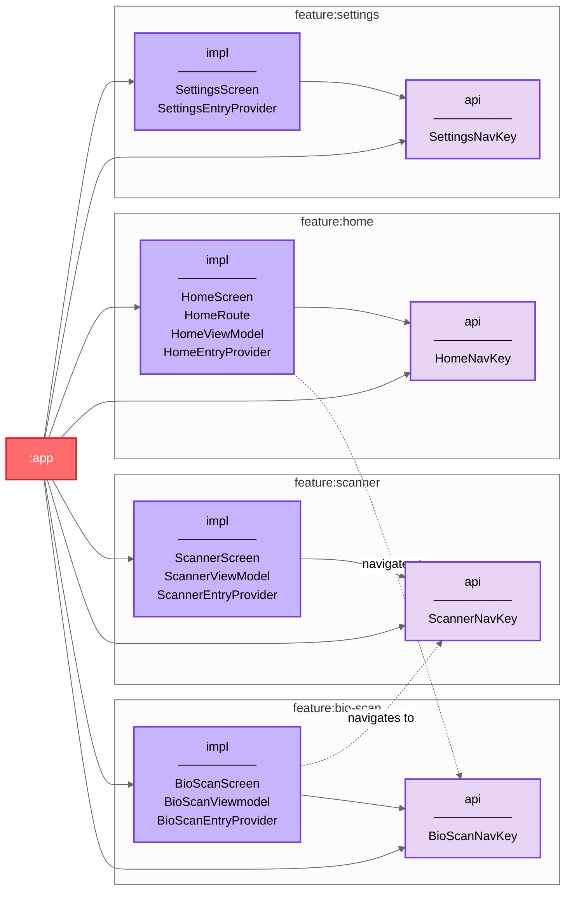

> [!IMPORTANT]
> Feature `impl` modules **never** depend on another feature's `impl`. They only import `api` modules for navigation keys. This is the key to build-time isolation.

---

## 3. Core Module Internal Dependencies

Detailed view of how the 13 core modules relate to each other.

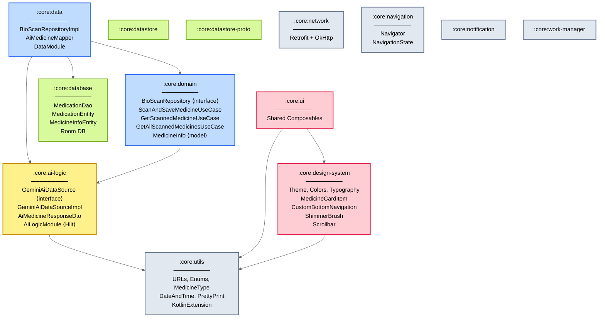

---

## 4. Medicine Scan — End-to-End Data Flow

The **core user journey**: capturing medicine images, sending them to Gemini AI, saving the result, and displaying it. This sequence diagram traces data through every architectural layer.

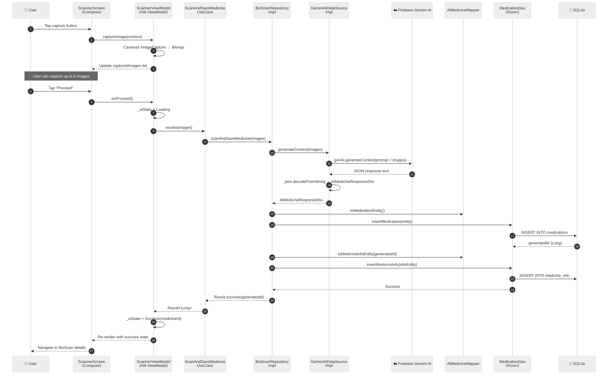

---

## 5. Navigation System — Multi-Stack Tab Architecture

Medyo uses a custom **multi-backstack navigation system** built on Jetpack Navigation 3. Each tab maintains its own sub-stack of screens.

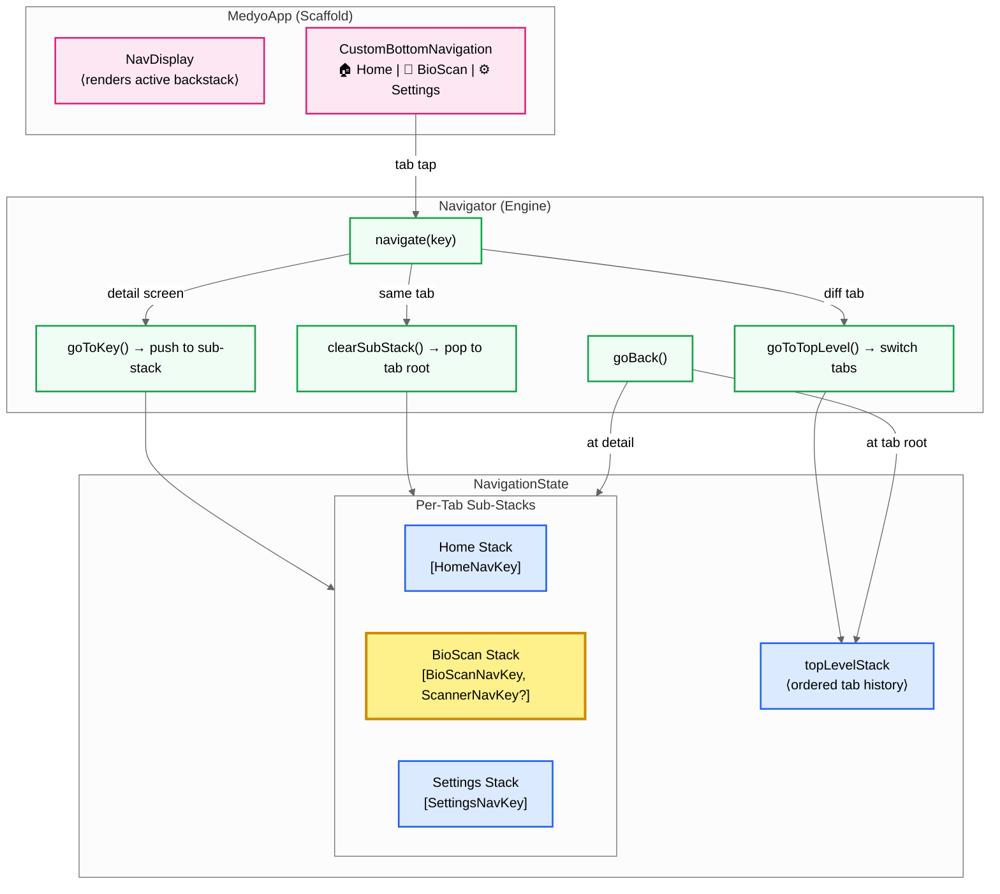

### Navigation Decision Tree

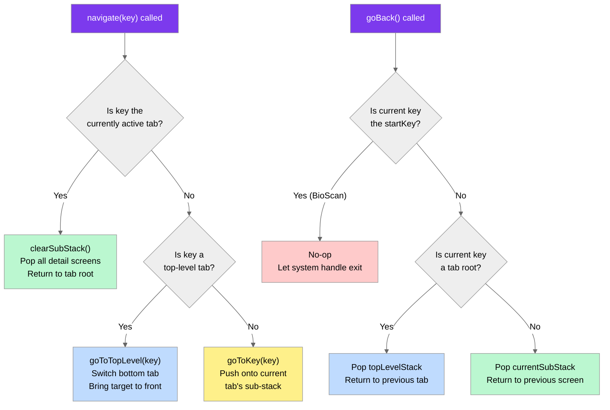

---

## 6. UI Layer — Unidirectional Data Flow (UDF)

This pattern is consistent across all feature `impl` modules. Shown here with the **Scanner** feature as a concrete example.

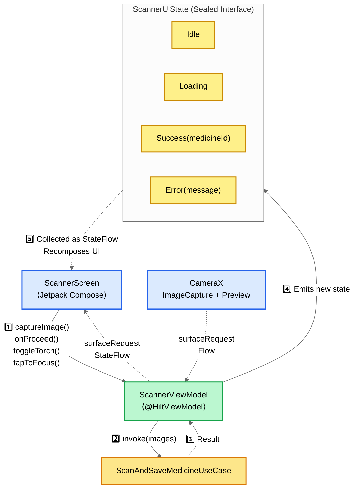

---

## 7. Data Layer — Repository Pattern

The `core:data` module implements the repository interface defined in `core:domain`, orchestrating between the AI data source and the local database.

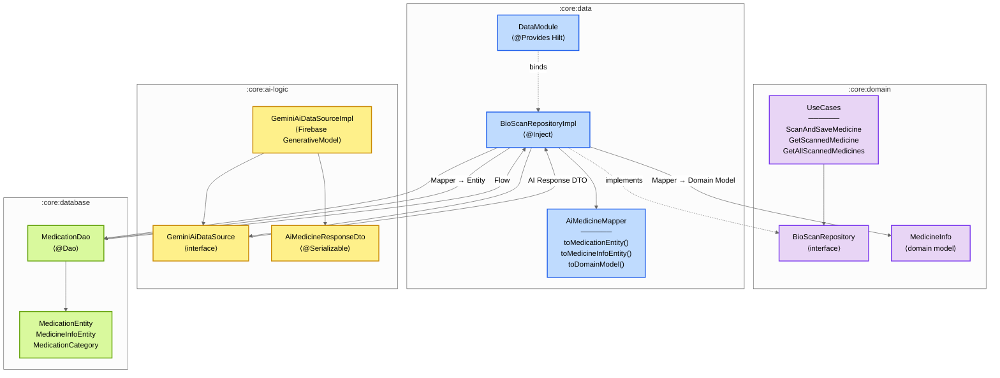

---

## 8. AI Logic Pipeline — Gemini Integration

The `core:ai-logic` module encapsulates all interaction with the Firebase Gemini generative AI model.

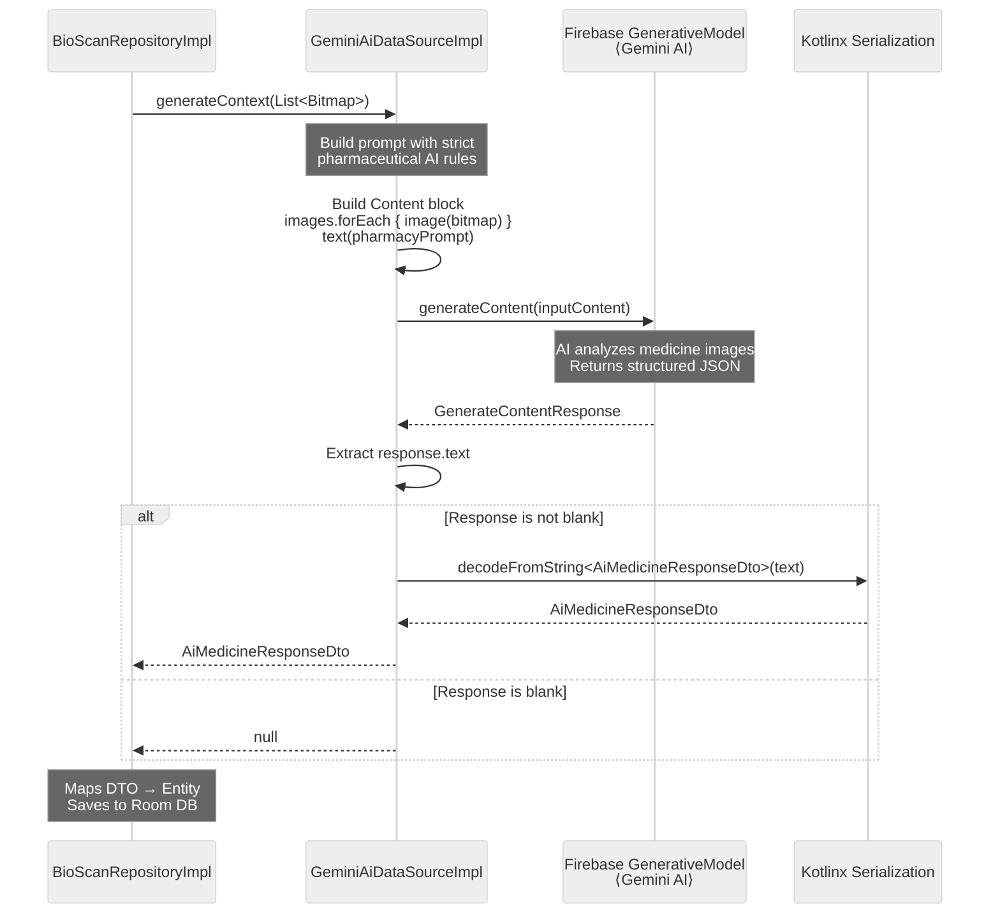

### AI Response Structure

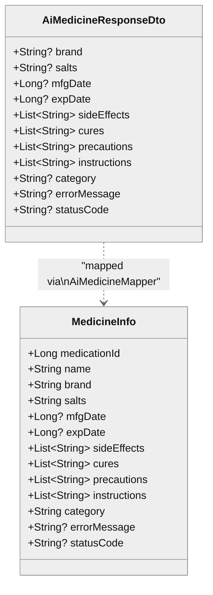

---

## 9. Logger Module — API/Impl Pattern

The logger follows the same API/Impl split as features, allowing it to be swapped for different platforms or implementations.

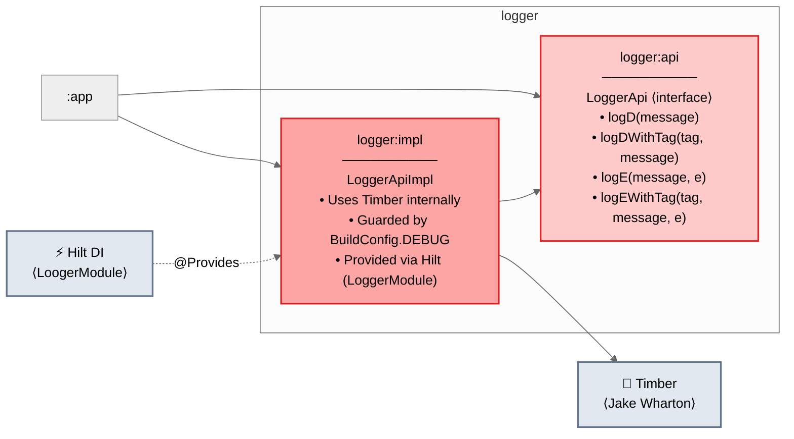

---

## 10. User Journey Flowchart

The complete user flow through the application, mapping which modules are involved at each step.

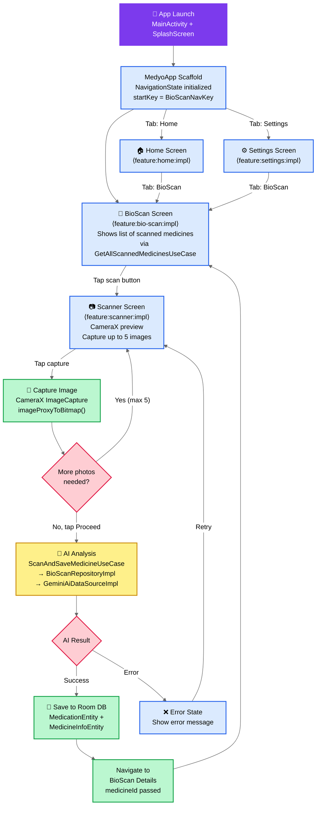

---

## Module Count Summary

| Category | Modules | Count |
|----------|---------|-------|
| **App** | `:app` | 1 |
| **Feature API** | `:feature:home:api`, `:feature:bio-scan:api`, `:feature:scanner:api`, `:feature:settings:api` | 4 |
| **Feature Impl** | `:feature:home:impl`, `:feature:bio-scan:impl`, `:feature:scanner:impl`, `:feature:settings:impl` | 4 |
| **Core** | `:core:data`, `:core:domain`, `:core:database`, `:core:ai-logic`, `:core:navigation`, `:core:design-system`, `:core:ui`, `:core:utils`, `:core:network`, `:core:notification`, `:core:datastore`, `:core:datastore-proto`, `:core:work-manager` | 13 |
| **Logger** | `:logger:api`, `:logger:impl` | 2 |
| **Total** | | **24** |

---

> [!TIP]
> The most critical data path in the app is: **ScannerScreen → ScannerViewModel → ScanAndSaveMedicineUseCase → BioScanRepositoryImpl → GeminiAiDataSourceImpl → Firebase Gemini → Room DB**. This is the heart of Medyo.

</body>